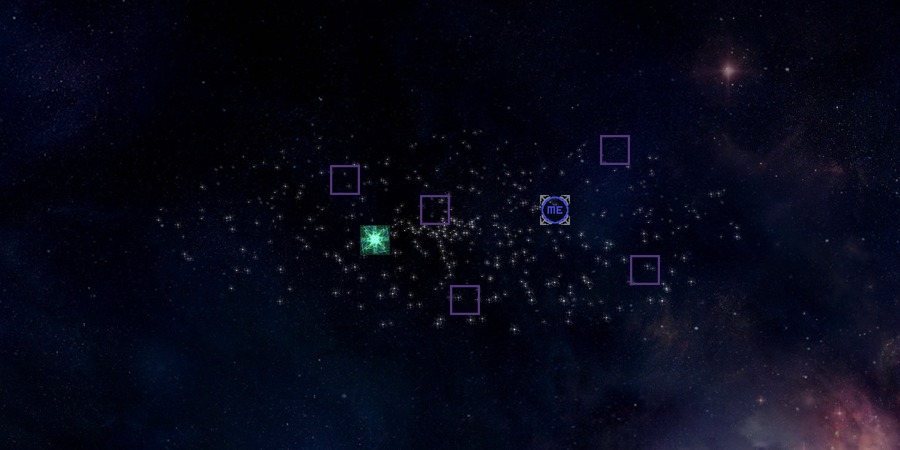

# Intruduction
This is a high school project I last worked on in 2016. It is a copy of the puzzle game at https://www.mathsisfun.com/games/orbox-game.html. Players try to navigate their way to the end in each level trying not to fall off into the edges of the screen.

# How to play
Move your player using the arrow keys. You cannot stop until you hit a flat surface. Play around in the tutorial for an introduction to all the blocks available.

Repeatedly press Esc to exit.
